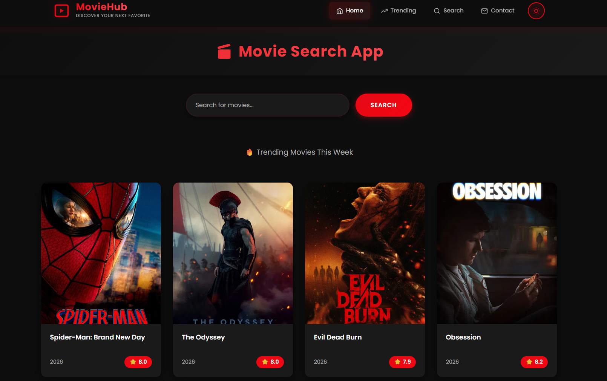
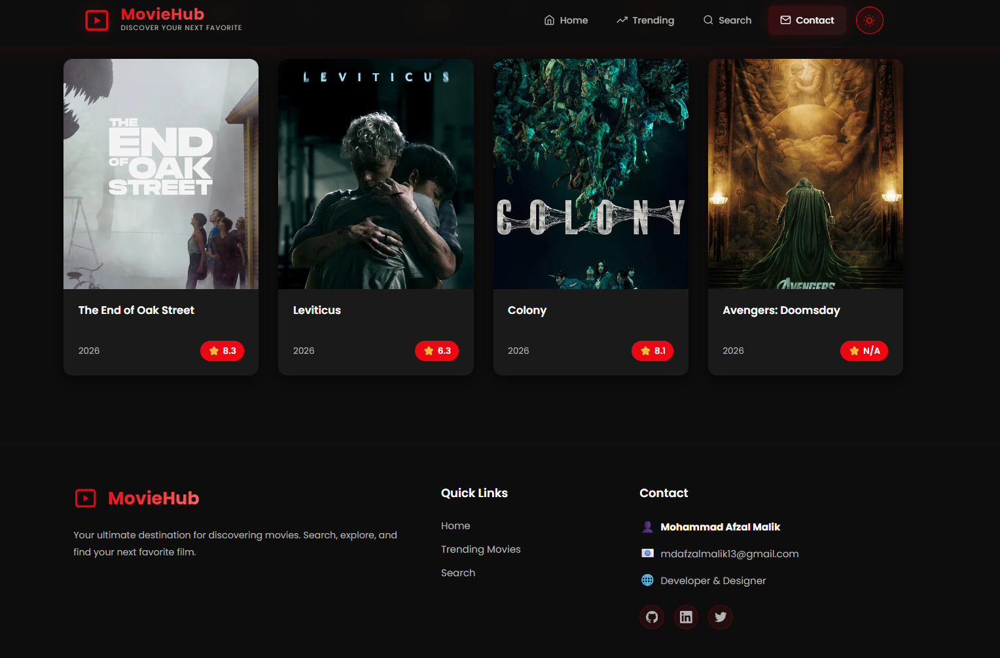

# MovieHub

A movie search web app powered by the TMDB API — discover trending movies and search for your next favorite film.

**Live site:** [movie-search-tmdb-ten.vercel.app](https://movie-search-tmdb-ten.vercel.app/)

<br/>

## Screenshots




<br/>

## Features

- **Search** — Find any movie via the TMDB API
- **Trending** — Browse trending movies of the week, updated dynamically with ratings and release year
- **Contact** — Get in touch section with developer details and social links
- **Dark theme UI** with a clean, card-based movie grid

<br/>

## Built With

- HTML
- CSS
- JavaScript
- TMDB API

<br/>

## Running Locally

```bash
git clone https://github.com/mdafzalmalik/movie-search-tmdb.git
cd movie-search-tmdb
```

Add your own [TMDB API key](https://www.themoviedb.org/documentation/api), then open `index.html` in your browser — no build step required.

<br/>

## Contact

[LinkedIn](https://www.linkedin.com/in/mdafzalmalik/) · [Email](mailto:mdafzalmalik13@gmail.com) · [LeetCode](https://leetcode.com/u/mdafzalmalik/)
